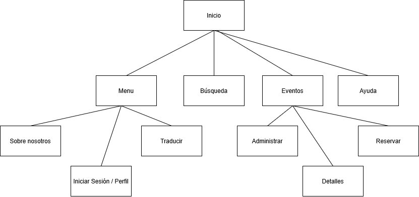
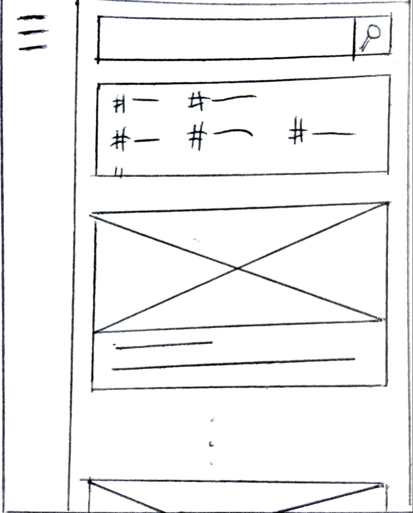
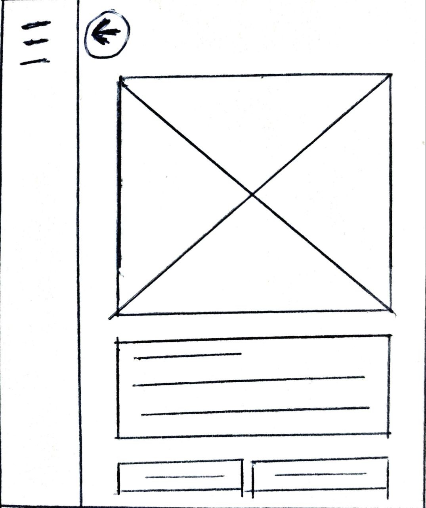

DIU - Practica2, entregables

Malla receptora de información 
Sitemap & Task flow 
Labelling 
Wireframe & User flow 

1. Malla receptora de información

**Interesante (Ideas Positivas)** | **Críticas**
| ------------- | -------
  eeee         |  Hay etiquetas pero no hay un sistema de tagging o etiquetado.
  eee     | El Buscador es demasiado simple.
  Forma de pago Segura |  No hay Mapa con el que interactuar, simplemente tiene una imagen.
  Dinámica e intuitiva |  No se pueden realizar eventos privados, solo hay públicos.
      eee              | No tiene traducción a otros idiomas
   eeeeee              |   Letra demasiado pequeña    
   
   
  **Preguntas** | **Nuevas ideas**
| ------------- | -------
  Nuestra aplicación debería hacer descuentos |  La aplicación podría ser Multiidioma
  Lleguen notificaciones personalizadas al móvil |  Enlazada a  Google Maps
  Aplicación en catalán |  La aplicación administra la agenda (añadiendo/quitando eventos)
  En vez de un mapa que fuese un modelo en 3D o sino en realidad aumentada |  Formulario de contacto para asistentes al evento
  Agregar a mis amigos del Facebook a la aplicación  | La aplicación permitirá mas métodos de pago, paypal, contrarrembolso y Bizum.
   Cuando se cree un evento que se cree un grupo de Whatsapp y vaya añadiendo a los nuevos asistentes al grupo automáticamente | La aplicación permitirá modificación del perfil y buscador avanzado.
  eeeee | La aplicación podría tener un chat interno para poder conversar.

  
2. Tareas
 //poner todas las tareas que decimos que vamos a tener.... poner todo!!!!!!!!!!!!!!!!!!!!!!!
 //ponerlas de mayor a menor, de mas highs a menos.
  **Task**                    | **Grupo1**  | **Grupo2** | **Grupo3**
  ------                  | ------  | ------ | ------:
  **Traducir al Español** | Low     | High   | Medium
  **Usar Maps**           | Medium  | Low    | High
  **Publicar imágenes**   | Medium  | Medium | High
  **Recordar contraseña** | Low     | High   | Medium
  **Pagar evento**        | Low     | High   | Medium
  **Agendar un evento** | Low     | High   | Medium
  **Usar el chat interno** | Low     | High   | Medium
  **Usar el buscador** | Low     | High   | Medium
  **Editar Perfil** | Low     | High   | Medium
  **Registrarte** | High    | High   | Medium
  **Borrar cuenta** | Low     | High   | Medium
  **Usar el formulario de contacto** | Low     | High   | Medium

//no hacerlo por grupos de conocimiento q sea por edad... o por distincion de competencias lingüisticas o que tareas hace un usuario logeado o que tareas un visitante //el invitado puede hacer búsquedas en el mapa traducir y busquedas avanzadas
  
  **Grupo 1:** Usuarios entre 18 y 40 años.
  
  **Grupo 2:** Usuarios mayores de 40 años.
  
  **Grupo 3:** Usuarios que han iniciado sesión.
  
  **Grupo 4:** Usuarios que No han iniciado sesión.

  
3. Jerarquía

**Término** | **Significado**     
| ------------- | -------
  Inicio  | Página principal (portada)
  Menú    | Se desglosa en varias funcionalidades
  Traducir  |
  Iniciar Sesión   | Conectarte para ver tus datos en tu perfil
  Sobre nosotros  | Detalles sobre los creadores
  Búsqueda  | Por palabra, etiquetas, sitio, …
  Eventos  | Un evento concreto
  Administrar  | Crear, editar, eliminar un evento
  Detalles  | Ver detalladamente un evento
  Reservar  | Pagar para un evento de otra persona
  Ayuda  | Dudas y pasos a seguir empleando un asistente y ejemplos de uso
  
  
4. Bocetos

