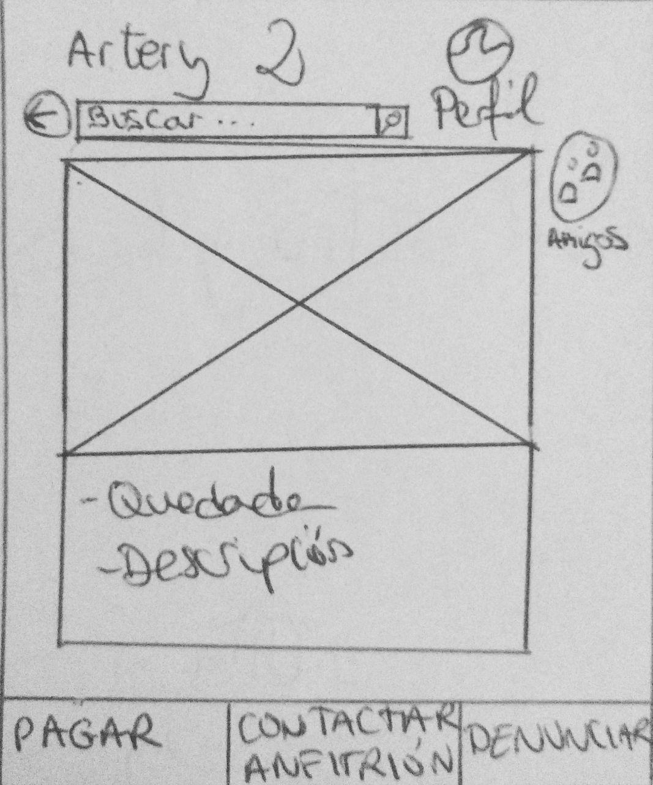

DIU - Practica2, entregables

Malla receptora de información 
Sitemap & Task flow 
Labelling 
Wireframe & User flow 

1. Malla receptora de información

**Interesante (Ideas Positivas)** | **Críticas**
| ------------- | -------
  Dinámica e intuitiva |  Hay etiquetas pero no hay un sistema de tagging o etiquetado.
  Títulos cortos ayudando a entender cada sección en un vistazo | El Buscador es demasiado simple.
  Forma de pago Segura |  No hay Mapa con el que interactuar, simplemente tiene una imagen.
   Sus imágenes ayudan a captar la atencion |  No se pueden realizar eventos privados, solo hay públicos.  
  Altamente Flexible, permite personalizar nuestro perfil y eventos a nuestro gusto | No tiene traducción a otros idiomas
   Abierto, la pagina solo se lleva un 5% del precio de cada evento el resto se lo llevan los anfitriones del evento |   Letra demasiado pequeña    
   
   
  **Preguntas** | **Nuevas ideas**
| ------------- | -------
  Nuestra aplicación debería hacer descuentos |  La aplicación podría ser Multiidioma
  Lleguen notificaciones personalizadas al móvil |  Enlazada a  Google Maps
  Aplicación en catalán |  La aplicación administra la agenda (añadiendo/quitando eventos)
  En vez de un mapa que fuese un modelo en 3D o sino en realidad aumentada |  Formulario de contacto para asistentes al evento
  Agregar a mis amigos del Facebook a la aplicación  | La aplicación permitirá mas métodos de pago, paypal, contrarrembolso y Bizum.
   Cuando se cree un evento que se cree un grupo de Whatsapp y vaya añadiendo a los nuevos asistentes al grupo automáticamente | La aplicación permitirá modificación del perfil y buscador avanzado.
  La aplicacion podría tener juegos incorporados para que los asistentes nos divirtamos antes de empezar el evento | La aplicación permite chatear con el anfitrion.

  
2. Tareas

  **Task** | **Grupo1**  | **Grupo2** | **Grupo3** | **Grupo4**
  | ------------- | ------- | ------- | ------- | ------- 
   **Acceder al feed** | High     | High   | High | High
   **Iniciar Sesión** | High     | High   | High | Medium
   **Búsqueda**   | Medium  | High | High | High
   **Usar Maps**           | High  | Medium    | Medium | Medium
   **Pagar** | High     | Medium   | Medium | 0
   **Métodos de pago** | Medium     | High   | High | 0 
   **Acceder a mis quedadas** | High     | Medium   | Medium | 0
   **Crear una quedada** | High     | Medium   | Medium | 0
   **Amigos** | High     | Low   | High | 0
   **Perfil** | High     | Low   | High | 0
   **Recordar contraseña** | Low     | High   | Medium | 0
   **Ajustes** | Low     | Medium   | High | 0
   **Contactar con anfitrión** | Medium     | High   | Low | 0
   **Filtrar contenido sensible** | Low     | Medium   | Medium | 0
   **Denunciar** | Low     | Medium   | Low | 0
   **Idioma** | Low     | Low   | Low | Low
   **Sobre nosotros** | Low     | Low   | Low | Low
   **Contactar** | Low     | Low   | Low | Low
   **Eliminar cuenta** | Low     | Low   | Low | 0
  

  **Grupo 1:** Usuarios entre 18 y 40 años.
  
  **Grupo 2:** Usuarios mayores de 40 años.
  
  **Grupo 3:** Usuarios que han iniciado sesión.
  
  **Grupo 4:** Usuarios que No han iniciado sesión.

  
3. Jerarquía

**Término** | **Significado**     
| ------------- | -------
  **Recordar contraseña** |  Recuperar contraseña.
  **Iniciar Sesión** | Botón para iniciar sesión o crear una cuenta nueva.
  **Acceder al feed** | Deslizarse por los eventos que se le muestran por pantalla de inicio al usuario. 
  **Búsqueda**   | Realizar una búsqueda para buscar un evento concreto o utilizando un tag determinado
  **Ver a mis quedadas** | Visualizar las quedadas a las que se ha unido o publicado por el usuario
  **Crear una quedada** | Crear un nuevo evento, en caso de no haber iniciado sesión redirige a iniciar sesión automáticamente
  **Ajustes** | Altera la configuración básica de la aplicación así como el perfil del usuario.
  **Amigos** | Ver lista de amigos y funcionalidad de chat con los mismos.
  **Pagar** | Unirse a una quedada, pagando automáticamente con la tarjeta que esté vinculada a la cuenta.
  **Contactar con anfitrión** | Inicia un chat con el anfitrión.
  **Denunciar** | Reportar un perfil por saltarse las políticas de la aplicación.
  **Perfil** | accede al perfil del usuario.
  **Idioma** | Cambiar el idioma actual del sistema.
  **Métodos de pago** | Cambiar el método de pago actual del sistema.
  **Sobre nosotros** | Accede a la información de los desarrolladores.
  **Contactar** | contactar con los creadores para enviar sugerencias.
  **Eliminar cuenta** | desactivar cuenta y borrar todos los datos.
  **Filtrar contenido sensible** | filtrar eventos que estén relacionados con temas sensibles (politica, sexo, religión etc)
  
4. Bocetos

Boceto de la página principal de la aplicación (el feed):

Boceto de un evento concreto:

Boceto de la sección de ajustes

5. Propuesta

La propuesta de nuestro proyecto se centra en mejorar la experiencia que un usuario podría tener con Artery. Por ello, nos quedamos con las buenas ideas que ya tiene Artery (tales como ...), evitamos/mejoramos las malas (como...), y agregamos ideas nuevas nuestras, como tal y tal. Ordenamos las principales tareas que los usuarios realizaran, algunas como ... que se encuentra en las ideas mencionadas anteriormente.
Proponemos una jerarquía que englobe las principales tareas e ideas mencionadas, enfocandola como  una app que se centra en la feed de quedadas publicadas, con una cabecera con el logo, barra de búsqueda e iniciar sesión; y un pie con las opciones de crear quedada, ver y gestionar mis quedadas ya publicadas, y el botón de ajustes.

También hacemos un pie para un evento concreto de la feed, que consta del botón de pagar y reservar, otro botón de contactar anfitrión, y un botón de denunciar evento por inapropiado.

Plasmamos esta jerarquía en los bocetos ilustrando las principales funcionalidades mencionadas en la jerarquía.
