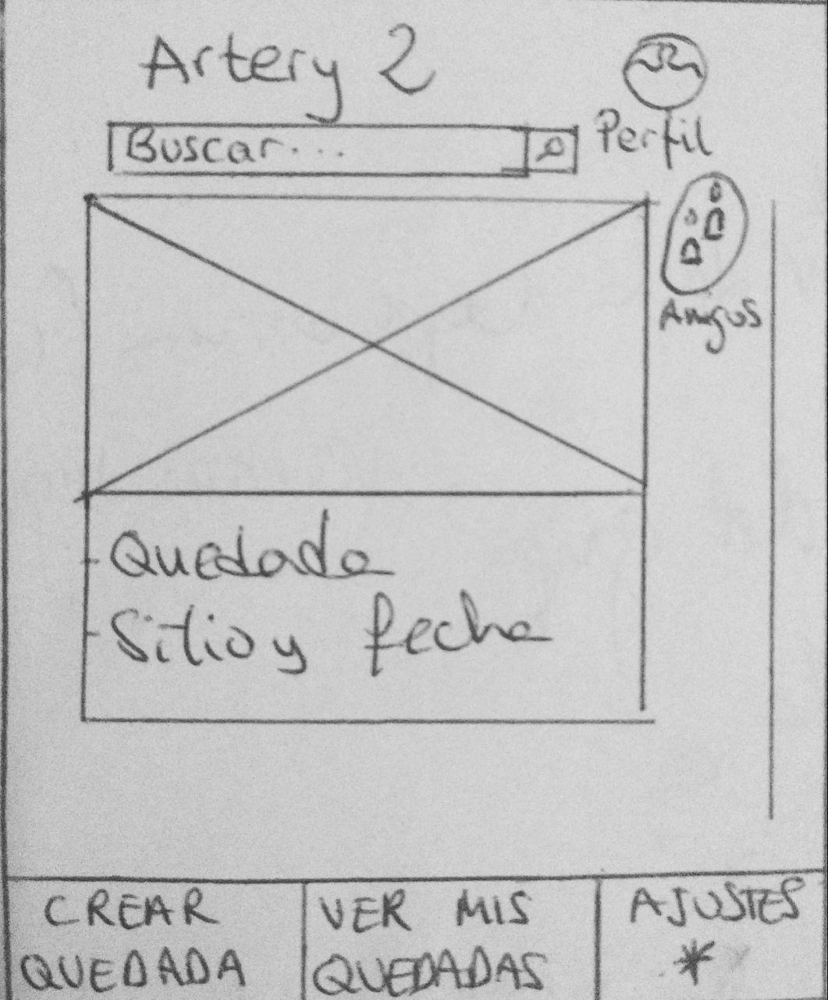

DIU - Practica2, entregables

Malla receptora de información 
Sitemap & Task flow 
Labelling 
Wireframe & User flow 

1. Malla receptora de información

**Interesante (Ideas Positivas)** | **Críticas**
| ------------- | -------
  Dinámica e intuitiva |  Hay etiquetas pero no hay un sistema de tagging o etiquetado.
  Títulos cortos ayudando a entender cada sección en un vistazo | El Buscador es demasiado simple.
  Forma de pago Segura |  No hay Mapa con el que interactuar, simplemente tiene una imagen.
   Sus imágenes ayudan a captar la atencion |  No se pueden realizar eventos privados, solo hay públicos.  
  Altamente Flexible, permite personalizar nuestro perfil y eventos a nuestro gusto | No tiene traducción a otros idiomas
   Abierto, la pagina solo se lleva un 5% del precio de cada evento el resto se lo llevan los anfitriones del evento |   Letra demasiado pequeña    
   
   
  **Preguntas** | **Nuevas ideas**
| ------------- | -------
  Nuestra aplicación debería hacer descuentos |  La aplicación podría ser Multiidioma
  Lleguen notificaciones personalizadas al móvil |  Enlazada a  Google Maps
  Aplicación en catalán |  La aplicación administra la agenda (añadiendo/quitando eventos)
  En vez de un mapa que fuese un modelo en 3D o sino en realidad aumentada |  Formulario de contacto para asistentes al evento
  Agregar a mis amigos del Facebook a la aplicación  | La aplicación permitirá mas métodos de pago, paypal, contrarrembolso y Bizum.
   Cuando se cree un evento que se cree un grupo de Whatsapp y vaya añadiendo a los nuevos asistentes al grupo automáticamente | La aplicación permitirá modificación del perfil y buscador avanzado.
  La aplicacion podría tener juegos incorporados para que los asistentes nos divirtamos antes de empezar el evento | La aplicación permite chatear con el anfitrion.

  
2. Tareas

  **Task** | **Grupo1**  | **Grupo2** | **Grupo3**
  | ------------- | ------- | ------- | ------- 
  **Usar Maps**           | Medium  | Low    | High
  **Recordar contraseña** | Low     | High   | Medium 
  **Iniciar Sesión** | Low     | High   | Medium
  **Acceder al feed** | High     | High   | High
  **Búsqueda**   | Medium  | Medium | High
  **Acceder a mis quedadas** | High     | High   | High
  **Crear una quedada** | High     | High   | High
  **Ver mis quedadas** | High     | High   | High
  **Ajustes** | High     | High   | High
  **Amigos** | High     | High   | High
  **Pagar** | High     | High   | High
  **Contactar con anfitrión** | High     | High   | High
  **Denunciar** | High     | High   | High
  **Perfil** | High     | High   | High
  **Idioma** | High     | High   | High
  **Métodos de pago** | High     | High   | High
  **Sobre nosotros** | High     | High   | High
  **Contactar** | High     | High   | High
  **Eliminar cuenta** | High     | High   | High
  **Filtrar contenido sensible** | High     | High   | High

//no hacerlo por grupos de conocimiento q sea por edad... o por distincion de competencias lingüisticas o que tareas hace un usuario logeado o que tareas un visitante //el invitado puede hacer búsquedas en el mapa traducir y busquedas avanzadas
  
  **Grupo 1:** Usuarios entre 18 y 40 años.
  
  **Grupo 2:** Usuarios mayores de 40 años.
  
  **Grupo 3:** Usuarios que han iniciado sesión.
  
  **Grupo 4:** Usuarios que No han iniciado sesión.

  
3. Jerarquía

**Término** | **Significado**     
| ------------- | -------
  **Recordar contraseña** |  Recuperar contraseña.
  **Iniciar Sesión** | Botón para iniciar sesión o crear una cuenta nueva.
  **Acceder al feed** | Deslizarse por los eventos que se le muestran por pantalla de inicio al usuario. 
  **Búsqueda**   | Realizar una búsqueda para buscar un evento concreto o utilizando un tag determinado
  **Ver a mis quedadas** | Visualizar las quedadas a las que se ha unido o publicado por el usuario
  **Crear una quedada** | Crear un nuevo evento, en caso de no haber iniciado sesión redirige a iniciar sesión automáticamente
  **Ajustes** | Altera la configuración básica de la aplicación así como el perfil del usuario.
  **Amigos** | Ver lista de amigos y funcionalidad de chat con los mismos.
  **Pagar** | Unirse a una quedada, pagando automáticamente con la tarjeta que esté vinculada a la cuenta.
  **Contactar con anfitrión** | Inicia un chat con el anfitrión.
  **Denunciar** | Reportar un perfil por saltarse las políticas de la aplicación.
  **Perfil** | accede al perfil del usuario.
  **Idioma** | Cambiar el idioma actual del sistema.
  **Métodos de pago** | Cambiar el método de pago actual del sistema.
  **Sobre nosotros** | Accede a la información de los desarrolladores.
  **Contactar** | contactar con los creadores para enviar sugerencias.
  **Eliminar cuenta** | desactivar cuenta y borrar todos los datos.
  **Filtrar contenido sensible** |  opción para filtrar eventos que estén relacionados con temas
sensibles (politica, sexo, religión etc)
  
4. Bocetos

