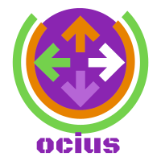

# DIU20
Prácticas Diseño Interfaces de Usuario 2019-20 (Economía Colaborativa) 

Grupo: DIU1_03UltraMerino.  Curso: 2019/20 

Proyecto: Ocius 

Descripción: Nuestra aplicación para dispositivos móviles fomenta que los usuarios asistan o creen eventos de ocio en sus casas compartiendo así experiencias únicas y conociendo gente nueva.

Logotipo: 

Miembros
 * :bust_in_silhouette:   Carlos Luaces Luaces     :octocat:     
 * :bust_in_silhouette:  Pablo Merino Ávila     :octocat:

----- 

En esta práctica estudiaremos un caso de plataforma de economía colaborativa y realizaremos una propuesta para su diseño Web/movil. Utilizaremos herramientas y entregables descritos en el siguiente CheckList (https://github.com/mgea/UX-DIU-Checklist) 

Qué es economia colaborativa: Martínez-Polo, J. (2019). **El fenómeno del consumo colaborativo: del intercambio de bienes y servicios a la economía de las plataformas**, *Sphera Publica, 1*(19), 24-46. http://sphera.ucam.edu/index.php/sphera-01/article/view/363/14141434

# Proceso de Diseño 

## Paso 1. UX Desk Research & Analisis 

 1.a Competitive Analysis
-----

>>> El tema general de las aplicaciones asignadas es el de compartir experiencias de ocio, es decir, todas aquellas plataformas cuyo objetivo es organizar eventos y que los usuarios se apunten a los que ellos deseen. 
Más concretamente, hemos elegido la plataforma [Artery](https://www.Artery.is) ya que es la que más nos ha llamado la atención.

 1.b Persona
-----

>>> Como personas, hemos elegido a [Aurelio](P1/persona_aurelio.png) que es una persona campesina alejada de la tecnología, y a [Ines](P1/persona_ines.png), otra persona con un uso más estándar de la tecnología.

 1.c User Journey Map
----

>>> Elegimos las experiencias de usuario que consideramos probables que le sucedan a los personajes creados, los cuales el primero es menos habitual que el segundo. Respectivamente, [Mapa de Aurelio](P1/journey_aurelio.png) y [Mapa Ines](P1/journey_ines.png) .

 1.d Usability Review
----
>>>  Revisión de usabilidad: (toma los siguientes documentos de referncia y verifica puntos de verificación de  usabilidad
>>>> SE deben incluir claramente los siguientes elementos
>>> - Enlace al documento: [Usability Review PDF](P1/Usability-review-template.pdf) [Usability Review XLS](P1/Usability-review-template.xls)
>>> - Valoración final (numérica): 61
>>> - Comentario sobre la valoración:
Hemos elegido Artery frente otros sitios web de la competencia principalmente por su diseño llamativo. Se han descartado sitios que promueven una sola clase de ocio (como Eatwith, que lo hace solo con eventos culinarios) ya que buscábamos un sitio más amplio, en el que haya eventos de cualquier tipo, tales como culinarios, musicales, audiovisuales, etc.

## Paso 2. UX Design  

 2.a Feedback Capture Grid
----

>>> En el feedback capture grid, hemos plasmado las ideas mas sobresalientes en artery, las cuales nos gustaría incluir en nuestra aplicación, además resaltado sus desventajas para tenerlas en cuenta y así mejorar la experiencia del usuario.

 2.b Tasks & Sitemap 
-----

>>> Ordenamos las principales tareas de mayor a menor, en función de cuánto creemos que se va a usar. Creamos además cuatro grupos de usuario y notamos 0, Low, Medium o High en función de cuántas veces ese grupo de usuarios realizará dicha tarea.
  

 2.c Labelling 
----

>>> Establecemos la jerarquía de nuestra aplicación respetando segun el nivel en el que se encuentra cada funcionalidad. 

 2.d Wireframes
-----

>>> Planteamos tres bocetos de la aplicación: [Pagina principal](img/boceto1.jpg) , [Un Evento](img/boceto2.jpg) y [Ajustes](img/boceto3.jpg)

## Paso 3. Mi equipo UX-Case Study

 3.a ¿Como se cuenta un UX-Case Study?
-----
>>> Analizamos y comentamos los métodos UX que se han llevado a cabo en MuseMap. En general, las técnicas usadas son buenas e interesantes y las usaríamos para nuestro proyecto.

  3.b Logotipo
----
>>> Nuestro logotipo proviene de la página https://editor.freelogodesign.org/?lang=es&companyname=ocius&category=31

>>> Nuestra aplicación se basa en [Artery](https://www.Artery.is), que es un sitio web que tiene como finalidad que los usuarios creen eventos de ocio y queden entre ellos. Por tanto, poroponemos el logo y la paleta de colores 

 

 3.c Guidelines
----

>>> Proponemos varios elementos de diseños y patrones a usar basándonos en las páginas recomendadas.
Por ejemplo, algunas de las propuestas son los subtítulos de imágenes, búsqueda avanzada, uso de mapas y calendarios integrados, etc.
En general son patrones para hacer más cómodo a los usuarios el funcionamiento de la herramienta.

  3.d Video
----

>>> Grabamos en un video de YouTube las principales novedades de nuestra herramienta de la práctica de la asignatura. El enlace está en el readme de la P3.

## Paso 4. Evaluación

 4.a Casos asignados
----

>>> Descripción de las asignaciones (3 UX Case Study) y enlace a sus repositorios.

>>>> En la seccioón P4/readme.md se debe acceder además a sus respectivas hojas de evaluación y conclusiones

 4.b User Testing
----

>>> Seleccione a una de sus personas ficticias. Exprese las ideas de posibles situaciones conflictivas de esa persona en las propuestas evaluadas

. 4.c Ranking
----

>>> Concluya con un ranking de los casos evaluados

>>> Valoración personal

## Paso 5. Evaluación de Accesibilidad  

  5.a Accesibility evaluation Report
----

>>> Indica qué pretendes evaluar (de accesibilidad) y qué resultados has obtenido + Valoración personal

>>> Evaluación de la Accesibilidad (con simuladores o verificación de WACG) 

## Conclusión / Valoración de las prácticas

>>> (90-150 caracteres) Opinión del proceso de desarrollo de diseño siguiendo metodología UX y valoración (positiva /negativa) de los resultados obtenidos  

